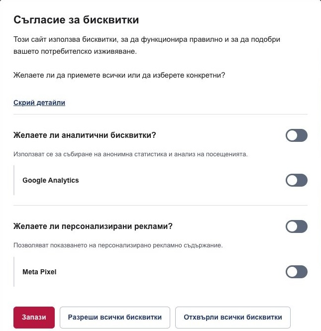
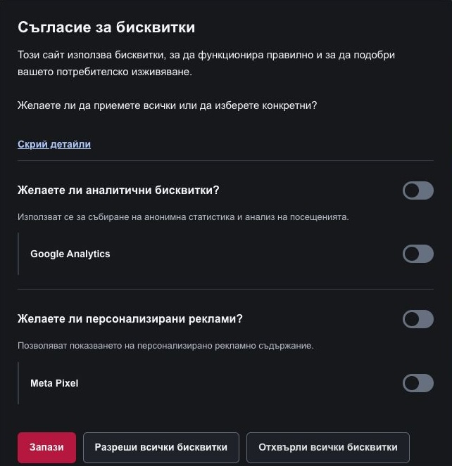

# Integration and customization

[Documentation index](index.md) · [Quick start](../README.md#quick-start)

## Routes and Twig helpers

| Route | Use |
| --- | --- |
| `cookie_consent.view_if_no_consent` | Render the banner only when the consent cookie or session choices are missing. |
| `cookie_consent.view` | Always render the forms, prefilled with available session choices. |
| `cookie_consent.update` | Submit either form with POST. Success returns HTTP 201 with JSON `"ok"` and the consent cookie. |

The two view routes accept a `locale` query parameter. Importing the routes with a
path prefix is supported: JavaScript submits to the generated form action.

All three Twig functions return booleans:

```twig
{# True after any saved choice, including Reject all #}

    <p>Your cookie preferences have been saved.</p>


{# True only when all stored vendors in the category are allowed #}

    {# Load integrations covered by this category. #}


{# Argument order: vendor first, category second #}

    {# Load this integration. #}

```

Place the per-vendor check around the complete integration code, wherever that
integration belongs in your layout: `<head>` or `<body>`. For example, an Analytics
loader placed in `<head>` must be inside the check there. Render the consent banner
itself once inside `<body>`. See [README step 7](../README.md#7-render-the-banner-and-guard-optional-scripts)
for separate placement examples and the optional reload listener.

Use these helpers during an HTTP request. For configuration changes that add
vendors, prefer the per-vendor helper; see [categories and vendors](configuration.md#categories-and-vendors).

## Let visitors change their choice

Provide a settings page owned by your application. Its controller should render a
Twig template like this:

```twig



    <h1>Cookie settings</h1>
    {{ render(path('cookie_consent.view', {locale: app.request.locale})) }}

```

Link to that application page from your footer. Make sure the base layout omits
its normal `view_if_no_consent` fragment on this page, so it renders only one banner.
The `view` endpoint itself is a fragment, not a full page with your layout and CSS.

A later rejection replaces the saved choices but cannot undo scripts already run
or delete third-party cookies. Reloading re-evaluates server-side guards; stopping
active integrations or removing their cookies requires application-specific code.

## JavaScript events

Events are dispatched on `document`:

| Event | `event.detail` | When |
| --- | --- | --- |
| `cookie-consent-form-submit-successful` | The submit button | After a successful response and dismissal of the banner. |
| `cookie-consent.form-submit-successful` | The same submit button | Compatibility alias emitted for the same submission. |
| `cookie-consent-form-submit-failed` | An `Error` | A network failure or unsuccessful HTTP response. The banner stays visible. |

Listen to only one success event to avoid handling a submission twice. The detail
contains the button, not the saved vendor preferences. To load scripts guarded by
Twig immediately after a choice, reload the page as shown in the README. This
listener is optional: without it, consent is still saved and Twig checks use the
new choice on the next page load. Register it once in your main JavaScript file,
or in a permitted inline `<script>` before `</body>`.

The default client logs failed submissions to the console; add your own visible
error message if needed. JavaScript is required for the intended experience.
Without it, the settings toggle and modal do not work, and form submissions lead
to a JSON response rather than a page redirect.

## Text and translations

Override the `CookieConsentBundle` translation domain in your application:

```yaml
# translations/CookieConsentBundle.en.yaml
cookie_consent:
    title: 'Your privacy choices'
    intro: 'Choose whether we may use optional services on this website.'
    read_more: 'Read our privacy policy'
    accept_all: 'Accept all'
    reject_all: 'Reject all'
    save: 'Save choices'
    cookie_settings_button: 'Choose services'
```

Replace the bundled placeholder introduction before publishing your site. The
introduction is rendered as raw HTML; keep its translations trusted and do not
insert unescaped user content into them.

Category and vendor labels use the `CookieConsentBundle` translation domain:

```yaml
# translations/CookieConsentBundle.en.yaml
cookie_consent:
    analytics:
        title: 'Analytics'
        description: 'Help us understand how visitors use the website.'
    vendors:
        my_analytics_service:
            title: 'My analytics service'
            description: 'Measures visits and page views.'
```

Replace `analytics` and `my_analytics_service` with your configured identifiers.
Add equivalent files for each supported locale. Missing titles fall back to
readable identifiers (for example, `my_service` becomes `My Service`); missing
descriptions are omitted. For visitors without a saved choice, all optional vendors are preselected in the
settings form. This does not grant consent or enable Twig-guarded scripts until
the visitor submits their choice. Existing saved preferences, including rejection,
are preserved when reopening settings.

Category switches select all vendors in that category;
individual vendors can also be selected separately when there are several. With
only one vendor, its name and description remain visible, while the category
switch controls its consent without a duplicate switch. “Back” preserves unsaved
choices; only submitting a form saves them.

For custom necessary-cookie names and descriptions, see the
[multilingual configuration example](configuration.md#translating-necessary-cookies).

## Template overrides

Create `templates/bundles/CookieConsentBundle/cookie_consent.html.twig`:

```twig



    <h2>Choose your cookie preferences</h2>

```

The banner template exposes these blocks: `pre_form`, `header`, `title`, `intro`,
`read_more`, `post_form`, `scripts`, `form_themes` and `necessary_cookies`. The title, introduction and privacy link
are nested in `header`. There are no `consent_form` or `required_cookies_category`
blocks in the current template. Replacing the form markup requires a full template
override or Symfony form theming.

Template variables are `simple_form`, `detailed_form`, `position` and
`read_more_route`, `theme` and `necessary_cookies`. Keep the form widgets and CSRF fields when customizing markup.
The JavaScript relies on `.cookie-consent`, `.cookie-consent__form`,
`.js-show-settings`, `.cookie-consent-simple` and `.cookie-consent-detail`.
Category toggles use `.consent-form-category` and `.consent-form-vendors`.

The bundled form theme is applied locally to both forms, independently of your
application's global form themes. To customize the controls, override the
`form_themes` block in the template above:

```twig

    
    

```

Start your custom theme with
`` and override
the required blocks. Preserve checkbox labels, hidden fields, CSRF fields and
the JavaScript hooks.

## Styles and assets

### Light and dark appearance references

These screenshots show the current detailed settings with Bulgarian translations.
Select [light, dark or automatic colors](configuration.md#theme) with `theme`.

| Light appearance | Dark appearance |
| --- | --- |
|  |  |


The included styling is a starting point. Load application overrides after
`cookie_consent_styling.html.twig`; you can customize the `--cc-*` properties, for
example `--cc-font-family`, `--cc-border-radius` and `--cc-dialog-backdrop-color`.
Both `bottom` and `top` are fixed, centered cards with responsive widths and
internal scrolling when the settings exceed the viewport height.

The template loads `bundles/cookieconsent/js/cookie-consent.min.js` as a module.
Do not include a second copy manually. Source files live under `assets/` and built
files under `public/` in the bundle. Re-run `assets:install public` after upgrades.

## Sessions and caching

The consent cookie and the application's session cookie serve different purposes.
Do not increase the consent cookie lifetime expecting the session choices to last
as long. Logging does not replace session storage.

Both view responses are private and marked `no-store`. The page that contains the
fragment can still leak personalized content if an application cache stores and
shares its rendered HTML. Keep consent-dependent pages private or implement a
cache design that isolates visitors' preferences.

ESI is an advanced alternative to inline fragments, not an automatic cache fix.
It needs Symfony ESI support, a compatible proxy and correct forwarding of cookies.
Do not share-cache consent forms containing session-specific CSRF tokens.
